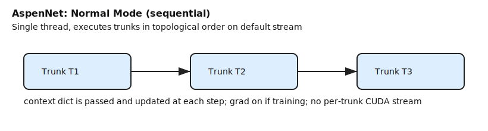
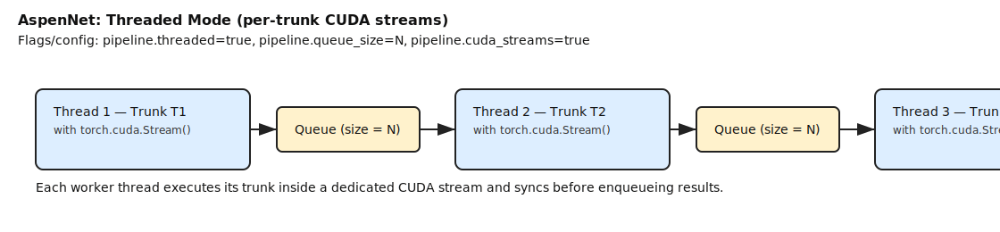

HockeyMOM

## Docs
- Repository guidelines: see [AGENTS.md](AGENTS.md).
- How to contribute: see [CONTRIBUTING.md](CONTRIBUTING.md).

## Web App (Django UI)
- Install (sudo): `sudo python3 tools/webapp/ops/install_webapp.py --watch-root /data/incoming --server-name _ --port 8008`. This creates `/opt/hm-webapp/app`, a venv at `/opt/hm-webapp/venv`, `hm-webapp.service`, and an nginx proxy on port 80 → 8008 (override with `--nginx-port`).
- Config: `/opt/hm-webapp/app/config.json`; uploads/watch root: `/data/incoming` (overridable via flag). Uninstall with `sudo python3 tools/webapp/ops/uninstall_webapp.py`.
- Seed demo data: `/opt/hm-webapp/venv/bin/python tools/webapp/scripts/seed_demo.py --config /opt/hm-webapp/app/config.json --email demo@example.com --name "Demo User"`.
- Access: `http://localhost/` (or `http://localhost:<nginx-port>/` if you used `--nginx-port`). Logs: `journalctl -u hm-webapp` and nginx error log in `/var/log/nginx/`.
- If nginx fails to start with `Address already in use`, stop/disable whatever is bound to the nginx listen port (often `apache2`), or rerun the installer with `--disable-apache2` / `--nginx-port`.

## System dependencies and native tools

For a fresh Ubuntu/Debian machine you should run, from the repo root:

```bash
./env/install_deps.sh
./build_deps.sh
```

- `env/install_deps.sh` installs the system libraries needed by the native C++ tools used by HockeyMOM:
  - Hugin CLI tools (`pto_gen`, `autooptimiser`, `nona`) for stitching.
  - Enblend/Enfuse and image/codec libraries (tiff, jpeg, png, OpenEXR, FFTW, wxWidgets, etc.).
  - These are required so the Bazel/CMake builds in `external/hugin` and `external/enblend-enfuse` succeed and the CLI binaries can run.
- `build_deps.sh` runs the Hugin Bazel build:
  - Changes into `external/hugin` and runs `bazelisk build //:install_tree`.
  - This drives CMake to build (and stage an install tree for) the Hugin command-line tools.
  - Those tools are then available to `hmcreate_control_points` and `hmstitch` for pano generation.

If you are on a different distro, use `env/install_deps.sh` as a reference list of required packages and install the equivalents manually, then run `./build_deps.sh`.

If you do **not** build these native tools, you will not be able to run Hugin-based stitching from raw left/right videos, but you can still run tracking on an already-stitched panorama (see below).

## Building and running hmtrack and stitching

You can run the CLIs either from an installed wheel (preferred for end users) or directly from this repo for development.

### From an installed wheel (recommended)

After building wheels with `./bdist_wheel` and installing them into your environment (e.g. `pip install dist/hmlib-*.whl dist/hockeymom-*.whl`), the CLI entry points are available on your `PATH`:

```bash
# Full pipeline from a configured game directory (stitch + track)
hmtrack --game-id ev-stockton-1 --output tracking_output-with-audio.mp4

# Explicit stitching step
hmstitch --game-id ev-stockton-1 -o stitched_output-with-audio.mp4
```

### From the repo checkout (no wheel install)

From the repo root you can invoke the same commands via Python modules:

```bash
# Tracking (equivalent to hmtrack)
python -m hmlib.cli.hmtrack --game-id ev-stockton-1 --output tracking_output-with-audio.mp4

# Stitching (equivalent to hmstitch)
python -m hmlib.cli.stitch --game-id ev-stockton-1 -o stitched_output-with-audio.mp4
```

Ensure your `PYTHONPATH` includes the repo root when running directly (for example, see `hm_run.sh` for how we set `PYTHONPATH` in development).

## Running hmtrack with a pre-stitched or panoramic video

If you already have a stitched panorama (for example, produced by `hmstitch` on another machine or by an external tool) and you do not have Hugin/enblend built locally, you can run tracking directly on that video and skip the stitching phase:

```bash
# Using an explicit stitched video (no game-id layout required)
hmtrack --input-video path/to/stitched_panorama.mp4 --output tracking.mp4

# From the repo without installed wheel
python -m hmlib.cli.hmtrack --input-video path/to/stitched_panorama.mp4 --output tracking.mp4
```

Optionally, if you still use a game directory layout under `$HOME/Videos/<game-id>`, you can combine `--game-id` with `--input-video` so the tracker can pick up game-specific config while reading frames from your pre-stitched file.

## Unified Configuration
- HM configs (`hmlib/config/` camera/rink/game/model) and Aspen graph configs (`hmlib/config/aspen/`) can be combined.
- Aspen YAMLs are nested under a top-level `aspen:` key (e.g., `aspen.plugins`, `aspen.inference_pipeline`, `aspen.video_out_pipeline`).
- The CLI merges multiple YAML files in order using `--config` (repeatable). Later files override earlier values and add new fields.
- Backward-compat `--aspen-config` has been removed. Use `--config` exclusively.

Examples
- Single file (everything in one YAML):
  - `./hm_run.sh --config my_unified.yaml`
- Compose baseline + Aspen graph:
  - `./hm_run.sh --config hmlib/config/baseline.yaml --config hmlib/config/aspen/tracking.yaml`
- Add rink- or game-specific overrides after base files:
  - `./hm_run.sh --config base.yaml --config rink/vallco.yaml --config hmlib/config/aspen/tracking_pose.yaml`

YAML structure (snippet)
```yaml
camera:
  name: GoPro
game:
  game_id: 2024-10-01
aspen:
  inference_pipeline: [...]
  video_out_pipeline: [...]
  plugins:
    detector_factory: {...}
    tracker: {...}
```

**AspenNet Execution Modes**
- Normal (sequential): single thread runs plugins in topological order.
  
  

- Threaded + CUDA streams: each plugin executes in its own thread and CUDA stream; queues connect stages.
  
  

- Threaded without streams: threaded execution on default stream/CPU; same queueing.
  
  

- Configure via YAML `aspen.pipeline`: `threaded: bool`, `queue_size: int`, `cuda_streams: bool`.
- CLI toggles: `--aspen-threaded`, `--aspen-thread-queue-size`, `--aspen-thread-cuda-streams` or `--no-aspen-thread-cuda-streams`.

**Video Clipper**
- Binary: `hmlib/cli/video_clipper.py`
- New options:
  - `--transition-seconds`: seconds for per-clip title cards (default 3.0; 0 disables transitions).
  - `--blink-circle`: overlays a blinking orange circle near the top-left around the clip midpoint.
  - `--blink-pre` / `--blink-post`: seconds before/after midpoint to blink (default 2.0/2.0).
- Behavior notes:
  - Circle is a 250px radius image mask overlaid at `x=10,y=10` and blinks 0.2s on/0.2s off.
  - When trimming with timestamps, decode-side `-t` is used and overlay uses `shortest=1` to ensure exact clip duration.

**Shift Spreadsheet Parser**
- Script: `scripts/parse_stats_inputs.py`
- Inputs:
  - `--input` can be a single `.xls/.xlsx` file or a directory (it will auto-discover the primary shift sheet plus optional `*-long*` companion sheets).
  - `--file-list` accepts one file/dir per line or `t2s=<game_id>[:HOME|AWAY][:game_label]` for a TimeToScore-only game (comments starting with `#` are ignored).
- Goals (highest priority wins):
  - `--goal` / `--goals-file`
  - TimeToScore via `--t2s <game_id>[:HOME|AWAY][:game_label]` (or inferred from filenames like `game-54111.xlsx` where the trailing number is `>= 10000`), using `--home/--away` or `:HOME/:AWAY` if needed.
  - `goals.xlsx` in the same directory as the input sheet (fallback when no TimeToScore id is in use).
- Optional `*-long*` sheet support:
  - Parses the leftmost per-period event table to add Shots/SOG/xG, Giveaways/Takeaways, and controlled entries/exits, plus generates event clip scripts and per-player SOG/goal highlight scripts.
  - If the script can’t infer whether your team is Blue or White, provide `--dark` (Blue) or `--light` (White).
- Privacy default:
  - Shift counts and TOI are omitted from parent-facing stats outputs by default. Use `--shifts` to include them.
  - Outputs (per game):
  - Writes under `<outdir>/(per_player|event_log)/` for single-game runs, or `<outdir>/<label>/(per_player|event_log)/` for multi-game runs.
  - Stats: `stats/player_stats.txt`, `stats/player_stats.csv`, `stats/player_stats.xlsx`, plus per-player `stats/*_stats.txt`.
  - Game stats: `stats/game_stats.csv` and `stats/game_stats.xlsx` (team-level, no TOI; stats are rows with the game as the column header).
  - Clip helpers (unless `--no-scripts`): `clip_events_<Event>_<Team>.sh`, `clip_goal_<player>.sh`, `clip_sog_<player>.sh`, and `clip_all.sh` (plus `clip_<player>.sh` for per-player shifts when `--shifts` is set).
  - Timestamp windows: per-player shift `*_video_times.txt` / `*_scoreboard_times.txt` (only with `--shifts`), plus `events_*_video_times.txt`, `events_*_scoreboard_times.txt`, and `goals_for.txt` / `goals_against.txt` (events: 10s before / 5s after; goals: 20s before / 10s after). `*_times.txt` files are not written with `--no-scripts`.
- Outputs (multi-game):
  - Consolidated workbook: `<outdir>/player_stats_consolidated.xlsx` with a `Cumulative` sheet and per-game sheets.
  - Consolidated CSV: `<outdir>/player_stats_consolidated.csv` (the `Cumulative` sheet).
  - Consolidated game stats: `<outdir>/game_stats_consolidated.xlsx` and `<outdir>/game_stats_consolidated.csv` (stats as rows, games as columns).
  - Long-sheet stats caveat: per-game averages for long-sheet-derived stats (Shots/SOG/xG/Giveaways/Takeaways, etc.) only count games where that stat exists, and the `... per Game` column headers include `(N)` to show the number of games in the denominator.
  - Per-player season summaries in `<outdir>/cumulative_per_player/`.
- Examples:
  - Single game by stats directory:
    - `python scripts/parse_stats_inputs.py --input /home/colivier/Videos/sharks-12-1-r2/stats --outdir player_shifts`
  - Season run from a list (files and/or directories):
    - `python scripts/parse_stats_inputs.py --file-list /mnt/ripper-data/Videos/game_list.txt --outdir season_stats`
  - Season highlight scripts (goals only) with a 30s window (20s before / 10s after) and no title-card transitions (requires per-game `tracking_output-with-audio*.mp4` next to `stats/`; use `--allow-missing-videos` to skip missing games):
    - `python scripts/parse_stats_inputs.py --file-list /mnt/ripper-data/Videos/game_list.txt --outdir season_stats --season-highlight-types Goal --season-highlight-window-seconds 30 --clip-transition-seconds 0`
    - Run all per-player season reels: `bash season_stats/season_highlights/clip_season_highlights_all.sh`
